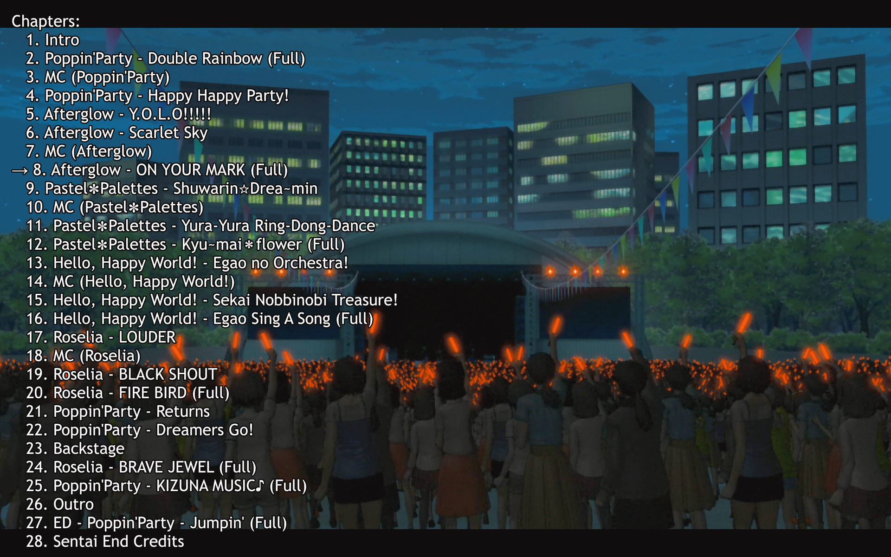

# chapter-list
An MPV script i wrote to show chapters in case you dont have osc



```conf
<key> script-binding chapter-list
```

## Usage
This script can be called in MPV with "F7" key, it will show a list of all chapters in the video, and highlight the current chapter. In case you want to configure the key add the following line to your input.conf file:

# crop-screenshot
This script allows you to capture and crop screenshots directly in MPV player. It uses the current video dimensions to crop the screenshot to the exact size of the video frame. The cropped screenshot is saved in the same directory as the original screenshot, with a `_cropped` suffix added to the filename.

## Usage:
The script is bound to the `Ctrl+s` key by default. Pressing this key will capture and crop the screenshot.

### Requirements:
ImageMagick must be installed on your system for the cropping functionality to work.
My windows setup has ImageMagick installed via winget
```
winget install -e --id ImageMagick.ImageMagick
```
## Installation
Copy the script to your scripts folder, usually located at `~/.config/mpv/scripts/` or `~/portable_config/mpv/scripts/` for portable installations.
